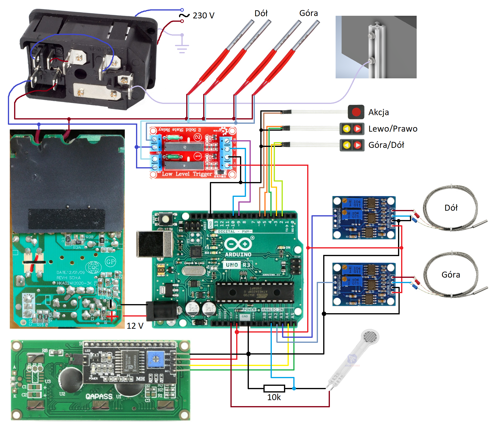
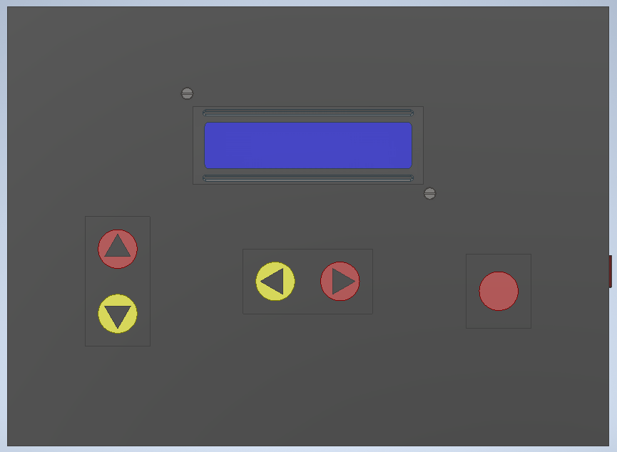

# Project-for-Master-Thesis

This project contains the entire source code for the heating press prototype realized as the Master Thesis of the author. Due to formal requirements, there are a lot of comments written in Polish to describe the functionality for people who are not software experts. Despite that, the code should be enough self-describing to be understood by the English speakers.

## Usage

The project is destined to be used on the Arduino UNO board. It can be compiled and uploaded by the Arduino IDE 2.0 or newer.

## Hardware

The electrical diagram compatible with the software is shown below.

## User Interface

The user interface, which is shown below, consists of 5 push buttons and a 16x2 characters LCD display.

